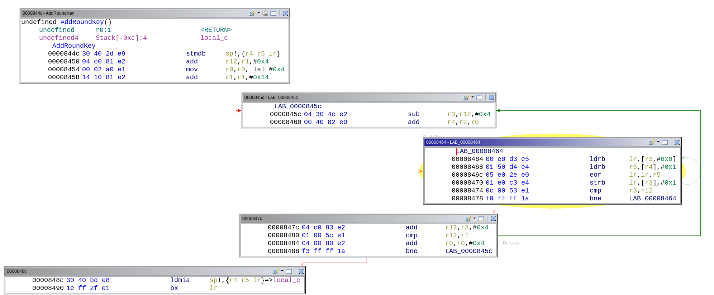
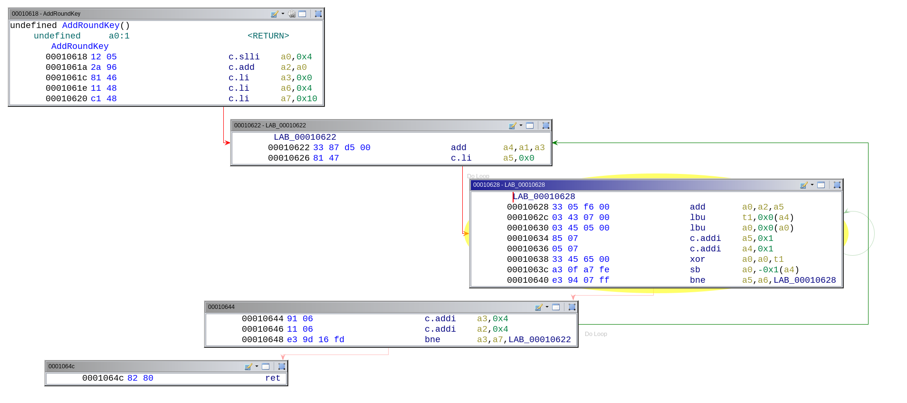
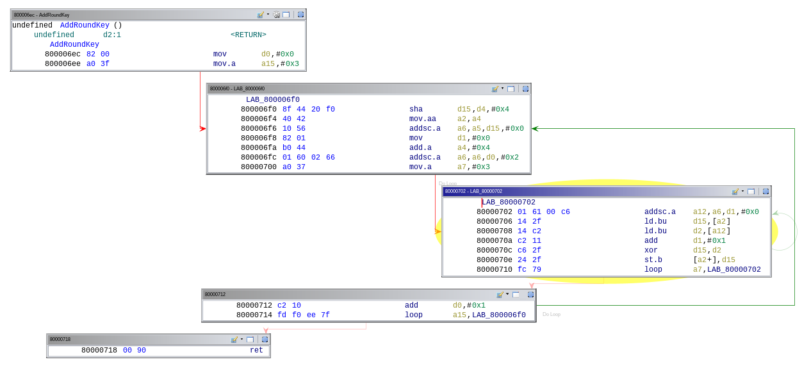
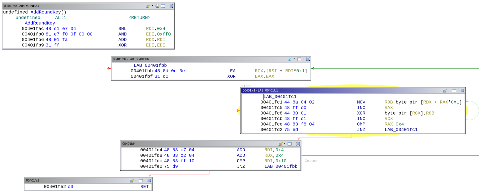

# Introduction
We have generated tinyAES binaries compiled for:
* ARM
* RISC-V
* Infineon Tricore
* x86 (64)

And below we show test faults for each of them when retrieving data from the sbox in AES.

# Arm

* Faulting line after this one: `ldrb r5,[r4],#0x01`
* Faulting address: `0x0000846c`
* Faulting register: r5

```
      1  >>> Output from address (0x00080f20) in register (r1) : 2c45ea42d60971c93149eb4250e0c821
      1  >>> Output from address (0x00080f20) in register (r1) : 2eee3a41b0a6b0f734468e0ddd823ad3
      1  >>> Output from address (0x00080f20) in register (r1) : 333c88dd35d593ba7ba369531c80cbdc
     24  >>> Output from address (0x00080f20) in register (r1) : 3ad77bb40d7a3660a89ecaf32466ef97
      1  >>> Output from address (0x00080f20) in register (r1) : 4d3b20152f1718a5fc2eeca51eb27886
      1  >>> Output from address (0x00080f20) in register (r1) : 65d2181dd9ff076b30feff3c9910da1f
      1  >>> Output from address (0x00080f20) in register (r1) : 88789c84b26fd72833b10bd36fbe1340
      1  >>> Output from address (0x00080f20) in register (r1) : c1c29e2068fe1b52d764e522bac1b842
      1  >>> Output from address (0x00080f20) in register (r1) : fd7c33ade091744c44940e9f0077aeac
```

# RISC-V


* Faulting line after this one: `lbu a0,0x0(a0)`
* Faulting address: `0x10634`
* Faulting register: a0 (== X10)

```
      1  >>> Output from address (0x0080ffb8) in register (X18) : 2c45ea42d60971c93149eb4250e0c821
      1  >>> Output from address (0x0080ffb8) in register (X18) : 2eee3a41b0a6b0f734468e0ddd823ad3
      1  >>> Output from address (0x0080ffb8) in register (X18) : 333c88dd35d593ba7ba369531c80cbdc
     24  >>> Output from address (0x0080ffb8) in register (X18) : 3ad77bb40d7a3660a89ecaf32466ef97
      1  >>> Output from address (0x0080ffb8) in register (X18) : 4d3b20152f1718a5fc2eeca51eb27886
      1  >>> Output from address (0x0080ffb8) in register (X18) : 65d2181dd9ff076b30feff3c9910da1f
      1  >>> Output from address (0x0080ffb8) in register (X18) : 88789c84b26fd72833b10bd36fbe1340
      1  >>> Output from address (0x0080ffb8) in register (X18) : c1c29e2068fe1b52d764e522bac1b842
      1  >>> Output from address (0x0080ffb8) in register (X18) : fd7c33ade091744c44940e9f0077aeac
```


# Tricore


* Faulting line after this one: `ld.bu d2,[a12]`
* Faulting address: `0x8000070a`
* Faulting register: d2

```
      1  >>> Output from address (0x70008f30) in register (A5) : 2c45ea42d60971c93149eb4250e0c821
      1  >>> Output from address (0x70008f30) in register (A5) : 2eee3a41b0a6b0f734468e0ddd823ad3
      1  >>> Output from address (0x70008f30) in register (A5) : 333c88dd35d593ba7ba369531c80cbdc
     24  >>> Output from address (0x70008f30) in register (A5) : 3ad77bb40d7a3660a89ecaf32466ef97
      1  >>> Output from address (0x70008f30) in register (A5) : 4d3b20152f1718a5fc2eeca51eb27886
      1  >>> Output from address (0x70008f30) in register (A5) : 65d2181dd9ff076b30feff3c9910da1f
      1  >>> Output from address (0x70008f30) in register (A5) : 88789c84b26fd72833b10bd36fbe1340
      1  >>> Output from address (0x70008f30) in register (A5) : c1c29e2068fe1b52d764e522bac1b842
      1  >>> Output from address (0x70008f30) in register (A5) : fd7c33ade091744c44940e9f0077aeac
```


# x86_64

* Faulting line after this one: `mov r8B, byte ptr [rdx + rax*0x1]`
* Faulting address: `0x00401fc5`
* Faulting register: r8

```
      1  >>> Output from address (0x08000fd0) in register (rsi) : 2c45ea42d60971c93149eb4250e0c821
      1  >>> Output from address (0x08000fd0) in register (rsi) : 2eee3a41b0a6b0f734468e0ddd823ad3
      1  >>> Output from address (0x08000fd0) in register (rsi) : 333c88dd35d593ba7ba369531c80cbdc
     24  >>> Output from address (0x08000fd0) in register (rsi) : 3ad77bb40d7a3660a89ecaf32466ef97
      1  >>> Output from address (0x08000fd0) in register (rsi) : 4d3b20152f1718a5fc2eeca51eb27886
      1  >>> Output from address (0x08000fd0) in register (rsi) : 65d2181dd9ff076b30feff3c9910da1f
      1  >>> Output from address (0x08000fd0) in register (rsi) : 88789c84b26fd72833b10bd36fbe1340
      1  >>> Output from address (0x08000fd0) in register (rsi) : c1c29e2068fe1b52d764e522bac1b842
      1  >>> Output from address (0x08000fd0) in register (rsi) : fd7c33ade091744c44940e9f0077aeac
```
